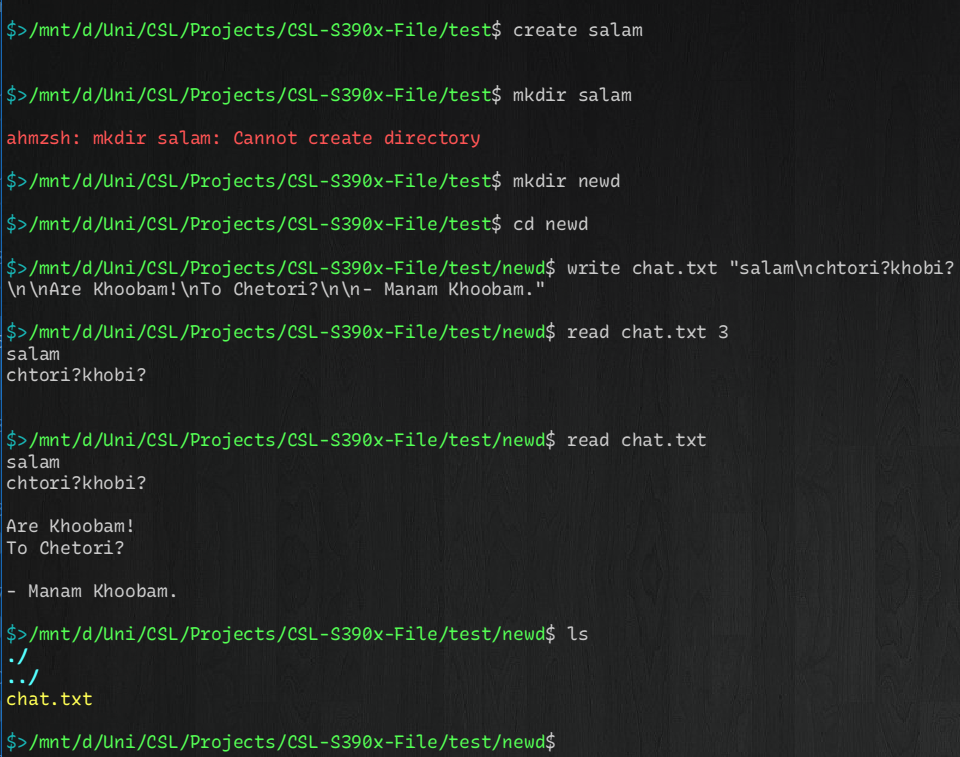

# S390x File Handling System

## Project Overview
This project implements a file handling system for the S390x architecture, designed to function similarly to a bash shell. It includes various functionalities such as file creation, deletion, reading, writing, and directory management. The project is part of the CSL 1403-1 course under the supervision of Dr. Asadi.



## Authors
- AmirMahdi Tahmasebi - 402106178
- AmirHossein Mirzaei - 402106661
- MohammadMahdi Rajabi - 402106015
- AmirHossein MohammadZadeh - 402106434

## Files and Descriptions

### [main.S](main.S)
This file contains the main function of the program. It handles the command loop and processes various commands such as `create`, `rename`, `delete`, `read`, `write`, `cd`, `mkdir`, `rmdir`, `ls`, and `time`.

### [fileop.S](fileop.S)
This file contains the file operations functions and macros. It includes macros for opening, closing, and managing files and directories.

### [iofuncs.S](iofuncs.S)
This file contains functions and macros for input/output operations. It includes macros for printing to the console, reading input, and handling file descriptors.

### [strfuncs.S](strfuncs.S)
This file contains functions and macros for string manipulation. It includes macros for calculating string length, converting numbers to strings, and comparing strings.

### [time.S](time.S)
This file contains the time to string conversion function. It converts time in seconds to a string format (HH:MM:SS).

## Usage
To use the S390x File Handling System, assemble and link the provided assembly files. Run the resulting executable to interact with the file handling system through the command line interface.

## Commands
- `create <filename>`: Create a new file.
- `rename <oldname> <newname>`: Rename a file.
- `delete <filename>`: Delete a file.
- `read <filename> [numberOfLines]`: Read a file.
- `write <filename> "<content>"`: Write content to a file.
- `cd <directory>`: Change the current directory.
- `mkdir <directory>`: Create a new directory.
- `rmdir <directory>`: Remove a directory.
- `ls`: List files and directories.
- `time`: Display the current time.
- `help`: Display help information.
- `exit`: Exit the program.

## Screenshot


## Acknowledgements
Special thanks to Dr. Asadi for his guidance and support throughout the project.
## Minimal Bash-like Example

Below is a minimal example of how the S390x File Handling System mimics bash-like commands:

```bash
# Create a new file
create example.txt

# Write content to the file
write example.txt "Hello, World!"

# Read the file content
read example.txt

# Rename the file
rename example.txt hello.txt

# List files and directories
ls

# Display the current time
time

# Remove the file
delete hello.txt

# Create a new directory
mkdir example_dir

# Change to the new directory
cd example_dir

# Remove the directory
cd ..
rmdir example_dir

# Exit the program
exit
```
